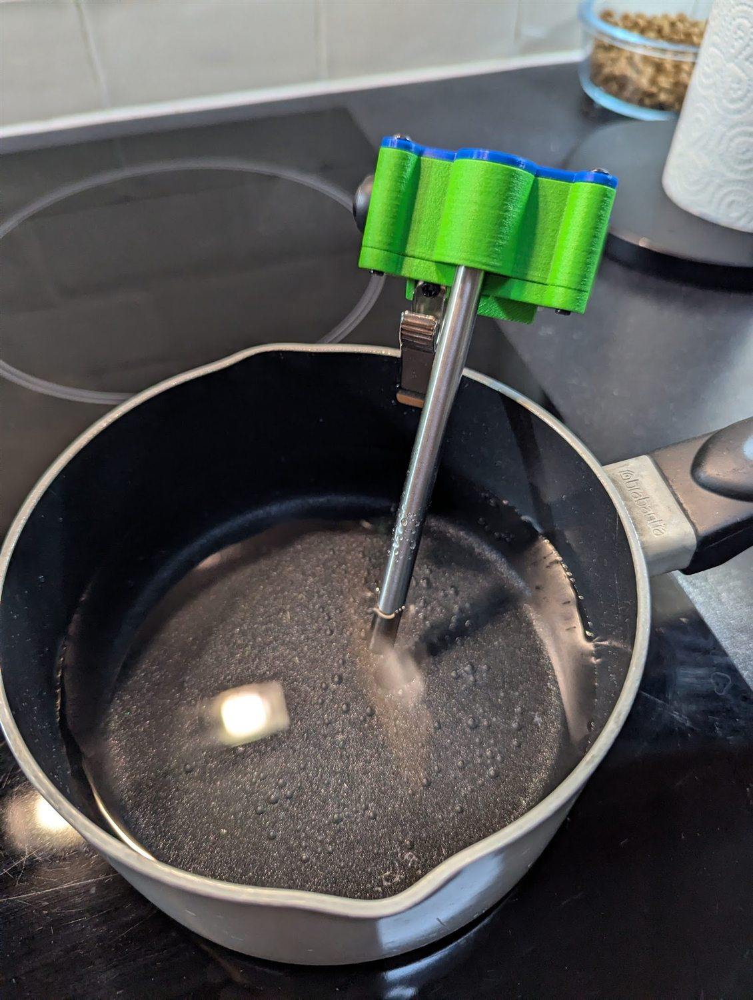
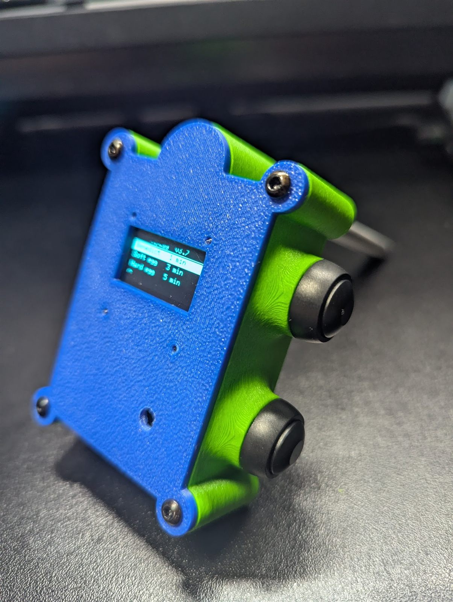
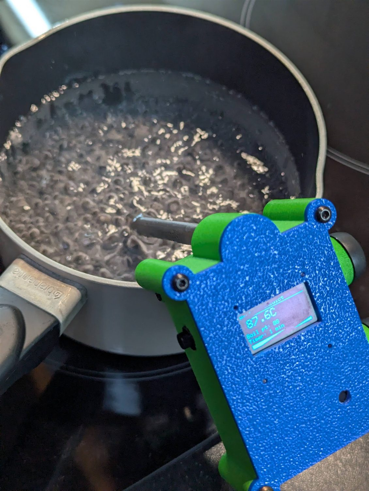
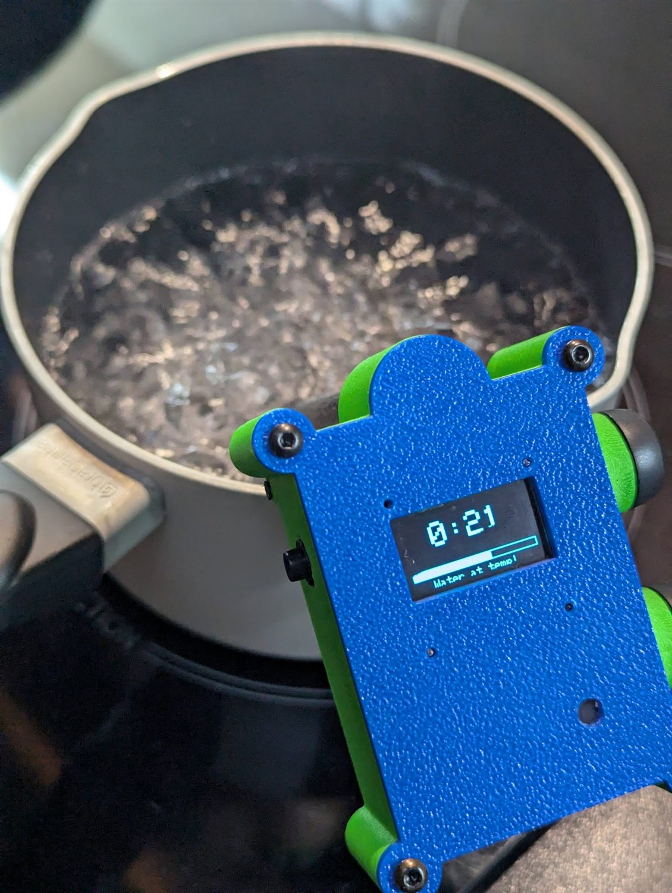
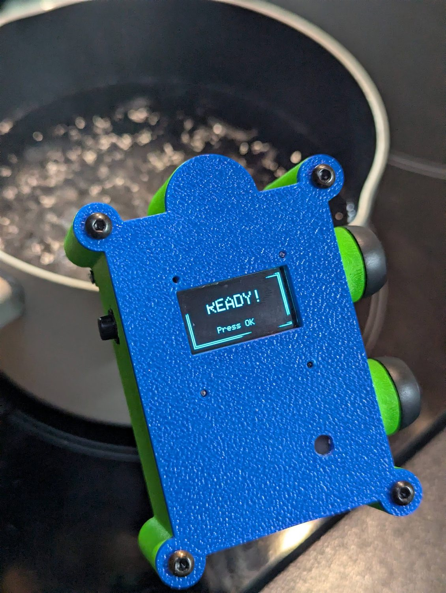
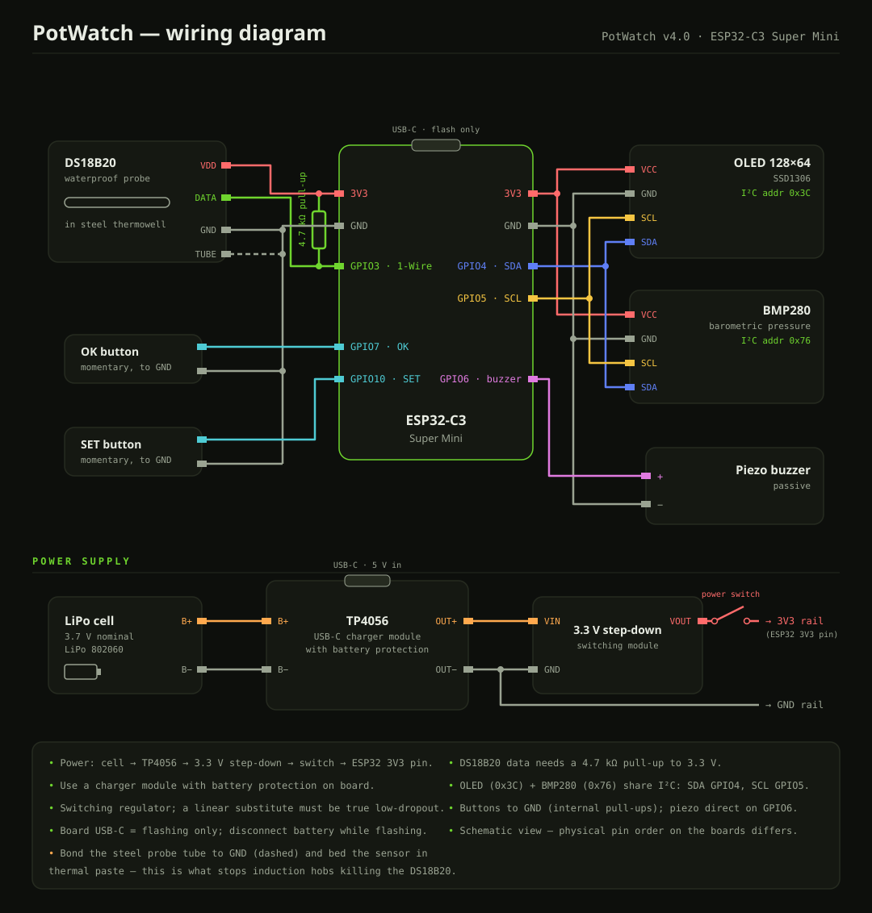

# PotWatch

**A clip-on kitchen timer that waits for the water to actually boil.**

*"A watched pot never boils" — so let PotWatch watch it.*

[**potwatch.net**](https://potwatch.net) · Open hardware · Free forever · Not patented, not trademarked

<p align="center">
  
  
</p>

---

Every kitchen timer has the same flaw: it starts counting when you press the button. But "3 minutes for a soft-boiled egg" means three minutes *of boiling*. So you stand at the stove watching for bubbles, guess the moment, and accept that breakfast is a coin flip.

PotWatch hangs on the rim of the pot with a stainless steel probe in the water. It waits until the water reaches the temperature you set, starts the countdown itself, and sounds the alarm when the food is done. Then you can walk away — which is the entire point.

Everything needed to build one is in this repository, and the full documentation is at **[potwatch.net](https://potwatch.net)**.

## It in use

<p align="center">
  
  
  
</p>

Left to right: **87.6 °C** against the 88 °C this unit triggers at — the water is working but the countdown has not started. Then the threshold is cleared five times over and the timer runs. Then it shouts.

There is a [12-second clip](video/potwatch-in-use.mp4) of the same thing happening.

## Why the temperature matters

Water does not boil at 100 °C. It boils at whatever the local air pressure dictates — lower at altitude, and drifting by a fraction of a degree as the weather changes. A device that waits for a fixed 100 °C either waits forever or starts early.

PotWatch carries a BMP280 barometer and computes its own threshold:

```
trigger = calibratedTemperature + (currentPressure − calibratedPressure) × 0.03
          clamped to 85…102 °C
```

A one-time calibration pins down the baseline for your kitchen; the barometer handles the daily drift.

**And the threshold does not have to be the boiling point.** What you are really setting is *the temperature at which the countdown starts*. Well before a full boil the water is already working hard — on the author's hob that point is around **88 °C**, which is a fine moment to start timing and turn the heat down. Gentler than a rolling boil, and for most things a better way to cook.

## Features

- **Confirmed detection** — the probe is read every second and five consecutive readings above threshold are required. Steam, splashes and stirring do not trigger it.
- **Pressure compensation** — automatic correction for altitude and weather.
- **Presets** — Benedict (1 min), soft egg (3 min), hard egg (5 min), soup (15 min – 2 h), free-form timer (1 min – 6 h).
- **Dry-pot protection** — if the water boils away and the probe passes 105 °C, the countdown stops and a `NO WATER` alarm sounds.
- **Probe fault detection** — a disconnected or failing sensor shows `CHECK PROBE` rather than inventing a number.
- **Non-blocking alarm** — the buzzer runs from a sequencer, so the buttons stay responsive while it sounds.
- **Self-resetting** — lift the probe out and it silences itself and returns to the menu.
- **Cordless** — LiPo cell, charges over USB-C.

## What is in here

```
├── firmware/potwatch/potwatch.ino   the firmware (Arduino, GPLv3)
├── hardware/
│   ├── wiring-diagram.svg           full schematic, including the power chain
│   └── models/                      STEP files for the printed parts
├── img/                             photographs
├── video/                           12-second demonstration
├── LICENSE.txt                      GPL v3 — the firmware
└── LICENSE-CC-BY-SA-4.0.txt         CC BY-SA 4.0 — hardware, models, docs
```

## Bill of materials

Roughly **€25** of common hobby parts.

| Part | Notes |
|---|---|
| ESP32-C3 Super Mini | The brain — flashes over USB-C, no programmer needed |
| DS18B20 | Buy the **waterproof probe** version, not the bare chip |
| Stainless steel thermowell | Ready-made, threaded fitting and cable gland; food-grade, cut to length |
| BMP280 barometer | I²C `0x76` — **not** the BME280, which looks identical |
| SSD1306 OLED, 128×64 | I²C `0x3C` |
| Passive piezo buzzer | **Passive**, not active — an active one knows only one note |
| 2 × panel-mount push button | SET and OK — the entire interface |
| 4.7 kΩ resistor | Pull-up for the sensor data line |
| Thermal paste + thin wire | **Do not skip** — see the induction warning below |
| LiPo cell, 3.7 V | 802060 pouch, 1000 mAh on the prototype |
| TP4056 USB-C charger | Get the version **with battery protection** |
| 3.3 V step-down module | Buck converter. A substitute must work from **under 4.2 V** and idle in microamps — **not** LM2596 or MP1584 (both need 4.5 V+), not AMS1117 |
| Self-locking power switch | Breaks the 3.3 V line after the regulator |
| Stainless spring clip | Bought part, screwed between the two printed holders |
| M3 × 6 mm screws ×6, 2 mm self-tappers ×4 | Self-thread into 2.8 mm and 1.8 mm printed holes |

## Wiring

| ESP32-C3 pin | Connects to |
|---|---|
| `GPIO3` | DS18B20 data — needs the 4.7 kΩ pull-up to 3.3 V |
| `GPIO4` | I²C SDA — OLED and BMP280 |
| `GPIO5` | I²C SCL — OLED and BMP280 |
| `GPIO6` | Piezo buzzer, driven directly |
| `GPIO7` | OK button → GND |
| `GPIO10` | SET button → GND |
| `GND` | Also bonded to the stainless thermowell — see below |

Power chain: **cell → TP4056 → 3.3 V step-down → switch → board 3V3 pin.** The board's own USB-C port is for flashing only.



## Printing

| Part | Material on the prototype |
|---|---|
| Enclosure, clip holders | Fibre-reinforced ABS |
| Cover | ASA |

Standard slicer settings, no supports needed. **ABS and ASA are chosen deliberately:** the device sits above a pot of steam, and PLA softens around 60 °C. Both want an enclosed printer; on an open-frame machine PETG is the sensible compromise.

The screw holes are printed undersized on purpose so the screws cut their own thread — no nuts and no inserts. Different filaments shrink differently, so test one hole before printing the lot. If you prefer heat-set inserts, open the holes out; the models are editable STEP.

## Flashing

1. Install the Arduino IDE and the Espressif ESP32 board package.
2. Install `OneWire`, `DallasTemperature`, `Adafruit GFX`, `Adafruit SSD1306`, `Adafruit BMP280`.
3. Keep `potwatch.ino` in a folder named `potwatch`.
4. Select your ESP32-C3 board. If the serial monitor stays silent, enable **USB CDC On Boot**.
5. Disconnect the battery, connect USB-C and upload.
6. Two beeps means it is alive. Serial at 115200 baud prints live temperatures.

Full instructions: **[potwatch.net/firmware](https://potwatch.net/firmware/)**

## Calibration

Boil a pot, put the probe in, open **Calibrate**, match the right-hand number to the left with SET/OK, hold SET for two seconds. Three beeps confirm it is stored.

Settings live in NVS under the namespace `clipegg` — the project's former name, kept deliberately so calibration survives firmware upgrades.

## ⚠️ If you cook on induction, read this

Early prototypes destroyed DS18B20 sensors one after another. The cause was the hob: a bare semiconductor inside a metal tube next to a large alternating magnetic field. The steel sleeve added to *protect* the sensor was acting as an antenna, feeding the interference straight into it.

Two changes fixed it:

1. **Bed the sensor in thermal paste** (ordinary CPU heatsink compound) before sliding it into the thermowell.
2. **Bond the steel thermowell to GND** with a wire.

The grounded tube becomes a shield rather than an antenna. The paste removes the air gap, which also makes the probe respond noticeably faster.

No failures since, over several months of induction use. That is months of evidence, not years — if you build one and still lose a sensor, please open an issue.

## Known issue — and where help is wanted

**The clip is the weak point.** It holds only when its screws are done up firmly, and the tension slackens with use. Slack enough and the device can tip, lifting the probe out of the liquid — where it will faithfully report that your water is cold and wait forever.

Conveniently, the mount is the most self-contained part of the design: **[`holder1.step`](hardware/models/holder1.step) and [`holder2.step`](hardware/models/holder2.step)** are what carry the spring clip, and nothing else depends on their shape. A better clamp costs you two files, not a rebuild.

If clamping mechanisms are your area, this is the single most valuable contribution the project could receive. Issues and pull requests welcome.

## Licence

- **Firmware** (`firmware/`) — [GNU GPL v3](LICENSE.txt)
- **Hardware, models, diagrams, photographs and documentation** — [CC BY-SA 4.0](LICENSE-CC-BY-SA-4.0.txt)

Nothing here is patented or trademarked, and it never will be.

### How to credit this project

If you publish a remix, a fork, a photo set or a build guide based on the models, diagrams or documentation, copy this line somewhere sensible — a description, a README, a caption:

> PotWatch by Ilia Kuzmin — https://potwatch.net — licensed [CC BY-SA 4.0](https://creativecommons.org/licenses/by-sa/4.0/). Modified from the original.

Drop the last sentence if you did not change anything. That is the whole obligation: **say who made it, link back, note that you changed it, and keep your version under the same licence.**

For the **firmware** the rules are different and a little lighter. GPL v3 does not ask you to advertise anyone. It asks you to keep the copyright notice in the source files, mark what you changed, publish your source under GPL v3 as well, and make that source available to anyone you give a device to. You are free to sell hardware running it.

**What is not covered:** copyright protects these *files*, not the idea. If you look at this thing and design your own from scratch, you owe nothing at all — go ahead, and tell me how it turned out.

---

Made by **Ilia Kuzmin**, 2026 — [3d.ilia.ireland@gmail.com](mailto:3d.ilia.ireland@gmail.com) · [3diy.ie](https://www.3diy.ie/)
